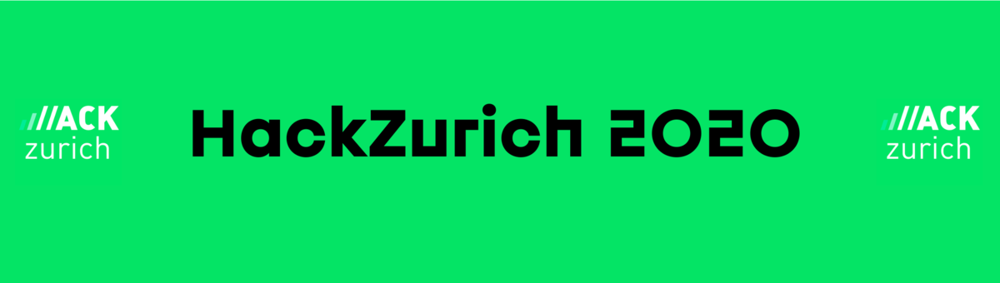
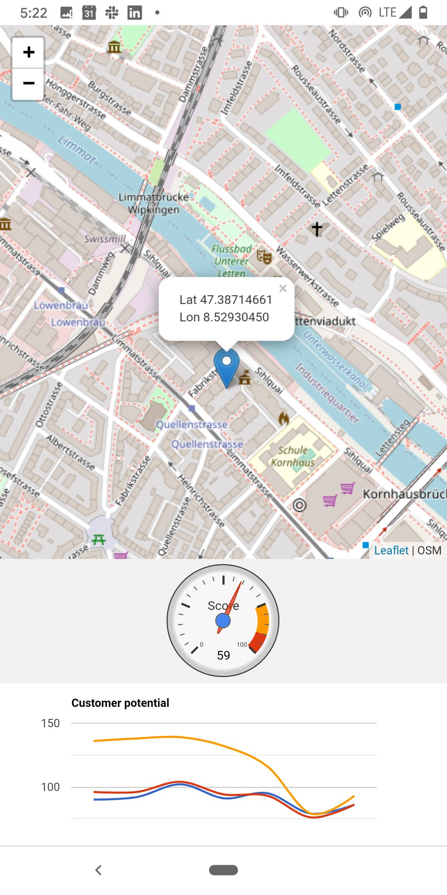
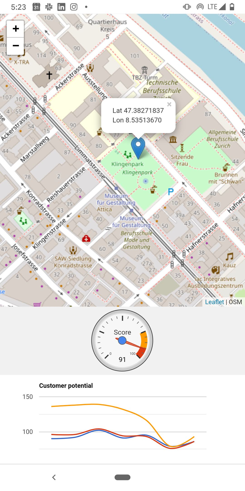
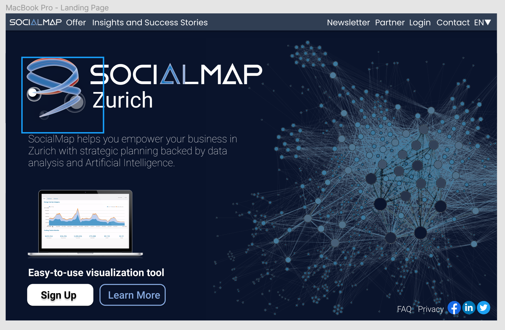

# Team Social Map  | HackZurich 2020

### <b>Problem Statement</b> - #14 SAFELY RECONNECT PEOPLE AND BUSINESSES (  )

What a year 2020 has been so far! People's mobility, habits and priorities have been turned upside down, impacting economy and social life. Can you leverage Swisscom data and help our society navigate through this crisis? Businesses need to better understand how their customers' habits have changed. Which areas were the most impacted and could they reach a larger public by relocating their stores? At the same time, we want the population to stay safe. Is it possible to predict crowded areas and recommend personalised alternatives like similar points of interest or a different time of the day? We will provide you with historical data of mobility and population density across the territory of major Swiss cities as measured by network activity. Feel free to combine our data with open-source datasets that could improve and enrich your recommendations.

More on the idea [Swisscom Mobility Insights](https://www.swisscom.ch/en/business/enterprise/offer/enterprise-mobile/mobility-insights.html?campID=SC_mobility)

### Use Case: [Dashboard](https://mip.swisscom.ch/) | [API](https://digital.swisscom.com/products/heatmaps/info)

- RETAIL

Swisscom Retail uses mobility indicators from the mobility insights platform to completely redesign its shop network. They went from a manual data informed process to a completely automatized dashboard identifying the most promising locations using machine learning algorithms.

- INSURANCE

One of the oldest private insurance companies in Switzerland, is using its Natel Go subscriptions to learn more about the work-related trips and Co2 emitted by its employees on its 3 major sites in Nyon, Bern and Zurich.

- GOVERNMENT

The Federal Office of Public Health (FOPH / BAG / OFSP) is using heatmaps and trip information from the mobility insights platform to see the average numbers of kilometers per inhabitant and per canton as well as density of people in selected public areas.

## FOR THE HACK [Final LIVE project](https://hackzurich20.herokuapp.com/)

> ### Webapplication: Flask, HTML, CSS, JavaScript, Bootstrap
> ### Backend, Machine Learning And Data Analysis: Python, C#
> ### Designs: Figma, Adobe Illustrator and Photoshop

 

 

[LIVE Figma Prototype](https://www.figma.com/proto/aILDLpl4Zsf7psDWIMpold/HZ?node-id=7%3A6&scaling=scale-down) Check it out here! Made changes to the final webapp [here](https://hackzurich20.herokuapp.com/)
